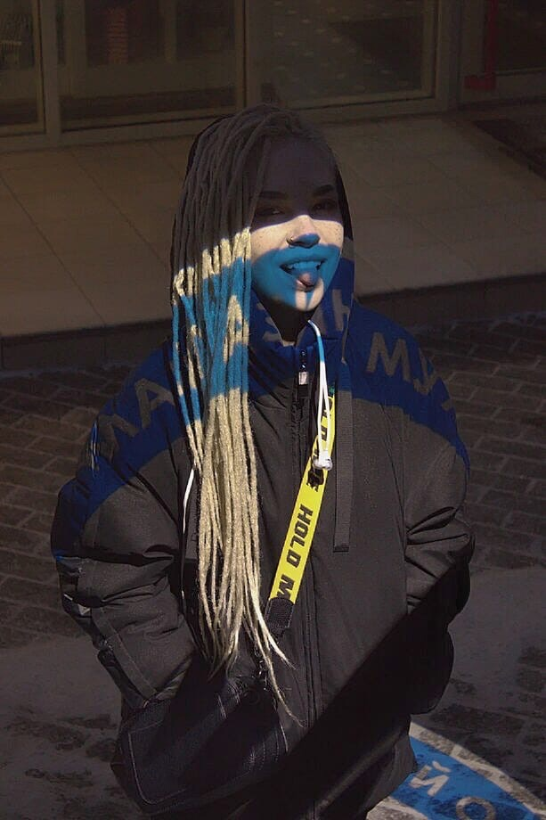

# Brief CV
 
 

## About me
My Name is Anastassyia, I'm 24 years old. I studied to be translator in Colledge of Languages "Lingua". I have ambitions, one of the most important thing in my life is career seif-realization. I tried many jobs in my life, but I understude that the most good for me is profession in which creativity and head work are combined, I feel pleasure when I strain my brains.
I didn't have work experiance in any coding company, but I countered some courses, such as Sololearn and Stepik.org. I want to be a specialist in my field and I realy like the huge amount of information that I learn and than I will learn.

## My skills
 - B2 english level
 - Experiance of communicating with native english speakers
 - Basic Knowledge of HTML and CSS
 - Basic Knowledge of JavaScript
 - Visual Studio code
 - Ability to find information
 - Basic Git and Github skills
 - Сommunicable
 - Non - conflict
 - Responsibility

 ## Education
 - [Sololearn "Python for beginners"](https://www.sololearn.com/learn/courses/python-introduction)
 - [Sololearn "JavaScript](https://www.sololearn.com/learning/1024)
 - [Sololearn "HTML](https://www.sololearn.com/learning/1014)
 - [Stepik "Программиррование на Python"](https://stepik.org/course/67/syllabus)
 - [Hexlet: Введение в программирование (JavaScript ES6)](https://stepik.org/course/13929/syllabus)
 - [Stepik "Веб разработка для начинающих"](https://stepik.org/course/38218/syllabus)

